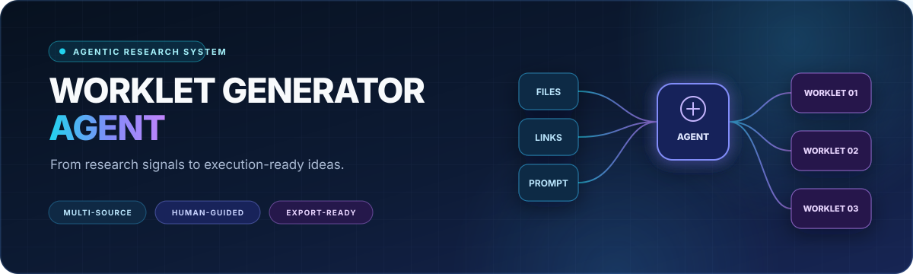
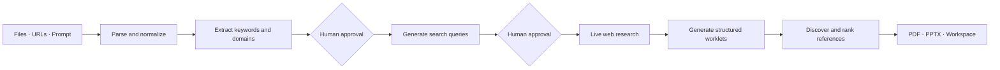

<!-- markdownlint-disable MD013 MD033 MD041 -->

<p align="center">
  
</p>

<p align="center">
  <strong>An agentic research workspace that turns scattered source material into structured, evidence-backed project opportunities.</strong>
</p>

<p align="center">
  <a href="https://www.python.org/"></a>
  <a href="https://fastapi.tiangolo.com/"></a>
  <a href="https://www.langchain.com/langgraph"></a>
  <a href="https://react.dev/"></a>
  <a href="https://www.mongodb.com/"></a>
  <a href="LICENSE"></a>
</p>

<p align="center">
  <a href="#why-worklet-generator-agent">Why it stands out</a> ·
  <a href="#how-it-works">How it works</a> ·
  <a href="#quick-start">Quick start</a> ·
  <a href="#configuration">Configuration</a> ·
  <a href="#api-surface">API</a>
</p>

---

Worklet Generator Agent bridges the gap between **research** and **execution**. Give it documents, images, spreadsheets, links, or a starting prompt; it extracts the important themes, searches the live web, develops concrete project ideas, discovers supporting scholarly and open-source references, and packages the result as polished PDF and PowerPoint deliverables.

The experience is deliberately collaborative. Users approve the extracted topics and search strategy before generation, then refine individual fields or create complete new iterations without losing earlier versions.

## Why Worklet Generator Agent

| Starting point | Agentic process | Delivered outcome |
| --- | --- | --- |
| Documents, presentations, images, spreadsheets, URLs, and free-form direction | Parse, normalize, extract themes, search, synthesize, source, rank, and format | A portfolio of structured worklets with references, milestones, KPIs, and downloadable reports |

Unlike a one-shot idea generator, this project treats ideation as a **traceable research workflow**:

- **Multi-source understanding** — combines local files, linked pages, OCR-derived content, and user context in one generation state.
- **Human-guided research** — pauses for approval of keywords, domains, and web queries before committing to a direction.
- **Live evidence discovery** — enriches generated ideas with web results, academic literature, and relevant GitHub repositories.
- **Structured synthesis** — produces typed worklets with problem statements, reasoning, use cases, deliverables, KPIs, prerequisites, infrastructure, technology choices, milestones, and references.
- **Versioned refinement** — preserves field-level revisions and complete worklet iterations, with explicit selection of the preferred version.
- **Presentation-ready output** — renders each worklet to PDF and PPTX, with individual or bundled downloads.

## What is a worklet?

A worklet is a compact, execution-oriented project brief. It moves an idea beyond a title by capturing the decisions needed to evaluate and start it.

| Dimension | What it captures |
| --- | --- |
| Opportunity | Title, problem statement, description, and reasoning |
| Application | Challenge, use cases, expected deliverables, and measurable KPIs |
| Feasibility | Prerequisites, infrastructure requirements, and technology stack |
| Execution | Milestones and implementation direction |
| Evidence | Ranked research papers, web sources, and GitHub repositories |

## How it works



The backend implements this flow as a stateful LangGraph pipeline:

```text
PROCESS_INPUT
  → EXTRACT_KEYWORDS_DOMAINS
  → GENERATE_WEB_SEARCH_QUERIES
  → WEB_SEARCH
  → GENERATE_WORKLETS
  → REFERENCES
  → RANK_REFERENCES
  → GENERATE_FILES
```

Socket.IO carries progress updates and approval requests to the interface while FastAPI handles generation, persistence, iteration, selection, and downloads.

## Core capabilities

### Rich input understanding

- Batch processing for mixed uploads
- Text extraction from PDF, DOC/DOCX, RTF, TXT, EPUB, ODT, PPT/PPTX, XLS/XLSX, CSV, HTML, XML, and Markdown
- OCR and optional vision-model analysis for JPG, JPEG, PNG, TIFF, BMP, and GIF content
- Embedded-image extraction from PDFs and presentations
- URL ingestion alongside files and direct prompts
- Context compression for large research inputs

### Research and synthesis

- Parallel Tavily searches across approved queries
- Dedicated reference-keyword generation for every worklet
- Academic reference discovery through Google Scholar
- Repository discovery through the GitHub Search API
- LLM-assisted relevance ranking before references reach the final worklet
- Structured model outputs validated through Pydantic schemas

### Interactive worklet studio

- Cluster-based organization with sortable project collections
- Thread history for every generation session
- Generation of one to six worklets per run
- Real-time pipeline status and approval modals
- Prompt-driven edits to individual worklet fields
- Full-worklet enhancement with iteration history
- Dark and light interface themes
- Single-worklet or full-thread PDF/PPTX downloads

## Architecture

| Layer | Responsibilities | Key technology |
| --- | --- | --- |
| Web client | Research input, approvals, progress, editing, version selection, downloads | React, TypeScript, Vite, Tailwind CSS, Radix UI, React Query |
| Realtime transport | Pipeline progress and human-in-the-loop checkpoints | Socket.IO |
| Application API | Workspace CRUD, generation, iteration, selection, file delivery | FastAPI, Pydantic, Uvicorn |
| Agent runtime | Deterministic orchestration and shared generation state | LangGraph, LangChain |
| Model layer | Local inference with configurable remote and provider fallbacks | Ollama, Gemini, OpenAI |
| Research layer | Live search plus scholarly and repository discovery | Tavily, Google Scholar, GitHub Search |
| Document intelligence | Text extraction, OCR, tabular parsing, and normalization | PyMuPDF, python-pptx, pandas, Tesseract |
| Persistence | Clusters, threads, worklets, versions, and references | MongoDB |
| Delivery | Programmatic reports and presentation decks | ReportLab, python-pptx |

## Typical workflow

1. Create a **cluster** for a research theme or portfolio.
2. Start a thread with files, links, a custom prompt, and the desired worklet count.
3. Review the agent's extracted domains and keywords.
4. Approve or edit the proposed web-search queries.
5. Follow generation progress in real time.
6. Inspect the resulting worklets and ranked references.
7. Refine a single field or generate an enhanced worklet iteration.
8. Select the preferred version and export it as PDF or PowerPoint.

## Quick start

### Prerequisites

- Python 3.11+
- Node.js 22+
- MongoDB
- [Ollama](https://ollama.com/) with the model configured in `core/constants.py`
- Tesseract OCR for image-based document extraction
- A Tavily API key for live web research
- Gemini API keys when the configured fallback is enabled

### 1. Clone and install

```bash
git clone https://github.com/Fyxod/Worklet-Generator-Agent.git
cd Worklet-Generator-Agent

python -m venv .venv
```

Activate the environment and install the backend dependencies:

```bash
# macOS / Linux
source .venv/bin/activate

# Windows PowerShell
.venv\Scripts\Activate.ps1

pip install -r requirements.txt
```

Install the frontend dependencies:

```bash
cd frontend
npm install
cd ..
```

### 2. Configure the environment

```bash
# macOS / Linux
cp .env.example .env

# Windows PowerShell
Copy-Item .env.example .env
```

Populate the provider keys in `.env`, confirm the MongoDB connection, and ensure the Ollama model name in `core/constants.py` exists locally.

### 3. Start local model endpoints

The default pipeline distributes model work across two Ollama servers.

```bash
# Terminal 1 — macOS / Linux
OLLAMA_HOST=0.0.0.0:11434 OLLAMA_KEEP_ALIVE=-1 ollama serve

# Terminal 2 — macOS / Linux
OLLAMA_HOST=0.0.0.0:11435 OLLAMA_KEEP_ALIVE=-1 ollama serve
```

```powershell
# Terminal 1 — Windows PowerShell
$env:OLLAMA_HOST = "0.0.0.0:11434"
$env:OLLAMA_KEEP_ALIVE = "-1"
ollama serve

# Terminal 2 — Windows PowerShell
$env:OLLAMA_HOST = "0.0.0.0:11435"
$env:OLLAMA_KEEP_ALIVE = "-1"
ollama serve
```

### 4. Launch the application

```bash
# Terminal 3 — API and realtime server
python backend.py

# Terminal 4 — web client
cd frontend
npm run dev
```

Open [http://localhost:5173](http://localhost:5173). The API runs at [http://localhost:8000](http://localhost:8000), with interactive OpenAPI documentation at [http://localhost:8000/docs](http://localhost:8000/docs).

## Configuration

| Variable | Purpose | Required for |
| --- | --- | --- |
| `DATABASE_URL` | MongoDB connection string | Persistence |
| `DATABASE_NAME` | Database name; defaults to `bedrock` | Persistence |
| `SECRET_KEY` | Application secret | Backend configuration |
| `TAVILY_API_KEY` | Live web-search access | Web research |
| `API_KEY_1` … `API_KEY_5` | Gemini fallback key pool | Gemini fallback |
| `OPENAI_API` | OpenAI provider key | Optional OpenAI fallback |
| `REMOTE_GPU` | Selects remote rather than local model access | Remote inference |
| `QUERY_URL` | Remote text-model endpoint | Remote inference |
| `USE_VISION_MODEL` | Enables vision-model image parsing | Optional visual analysis |
| `VISION_URL` | Remote vision-model endpoint | Remote visual analysis |

Model names, local ports, prompt limits, and fallback switches live in [`core/constants.py`](core/constants.py).

## API surface

| Area | Endpoints |
| --- | --- |
| Health | `GET /health/` |
| Clusters | `GET /clusters/`, `POST /clusters/`, `GET/PATCH/DELETE /clusters/{cluster_id}` |
| Generation | `POST /generate/` |
| Field iteration | `POST /iterate/`, `POST /select/` |
| Worklet iteration | `POST /worklet-iterations/enhance`, `POST /worklet-iterations/select-default` |
| Threads | `GET /thread/all`, `GET /thread/{thread_id}`, `DELETE /thread/delete/{thread_id}` |
| Exports | `GET /thread/{thread_id}/download/all/{file_type}`, `GET /thread/{thread_id}/download/{worklet_id}/{file_type}` |

Generation progress and human approval checkpoints are delivered over Socket.IO events.

## Repository map

```text
Worklet-Generator-Agent/
├── app/                    # FastAPI routes, Socket.IO handlers, broadcasts
├── core/
│   ├── llm/                # Model clients, prompts, and structured outputs
│   ├── parsers/            # Document, spreadsheet, and image extraction
│   ├── references/         # Scholar, GitHub, and relevance workflows
│   ├── services/           # Upload processing
│   └── utils/              # Versioning, export, compression, normalization
├── pipeline/               # LangGraph state, nodes, tools, and graph builder
├── frontend/               # React + TypeScript application
├── backend.py              # API entry point
└── frontend.py             # Convenience frontend launcher
```

## Engineering highlights

- Async batch parsing and parallel search/reference workloads reduce end-to-end latency.
- Two local model endpoints distribute generation and reference tasks.
- Typed state and structured LLM outputs keep a long, multi-stage agent run predictable.
- Persistent, selectable iterations make AI-assisted editing reversible.
- Centralized error responses provide a consistent API contract.
- Filename sanitization and normalized content handling protect the export pipeline.

## License

Licensed under the [Apache License 2.0](LICENSE).
